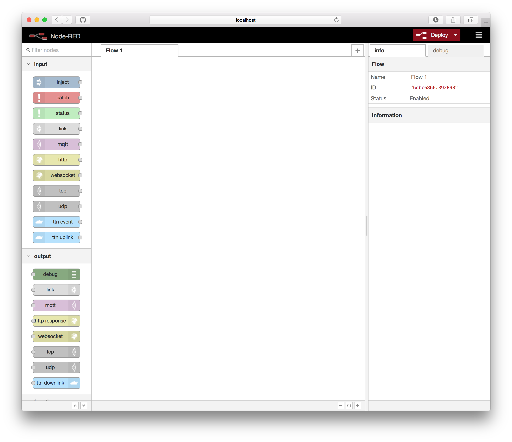
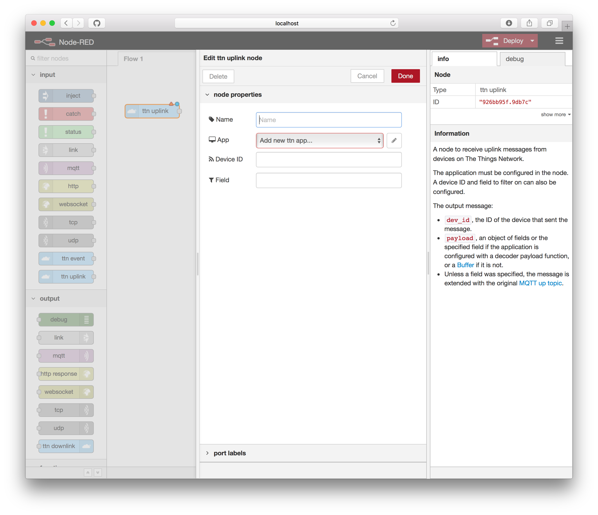
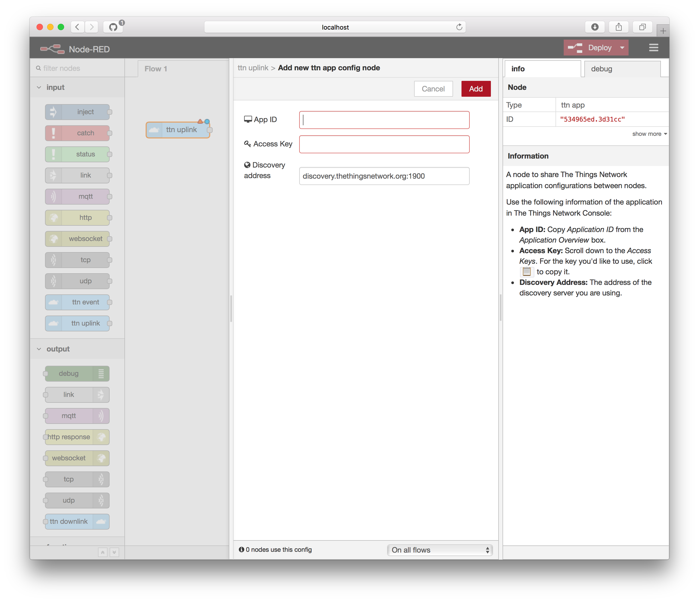
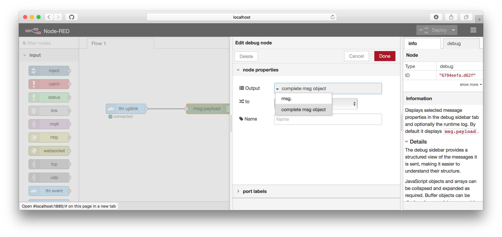
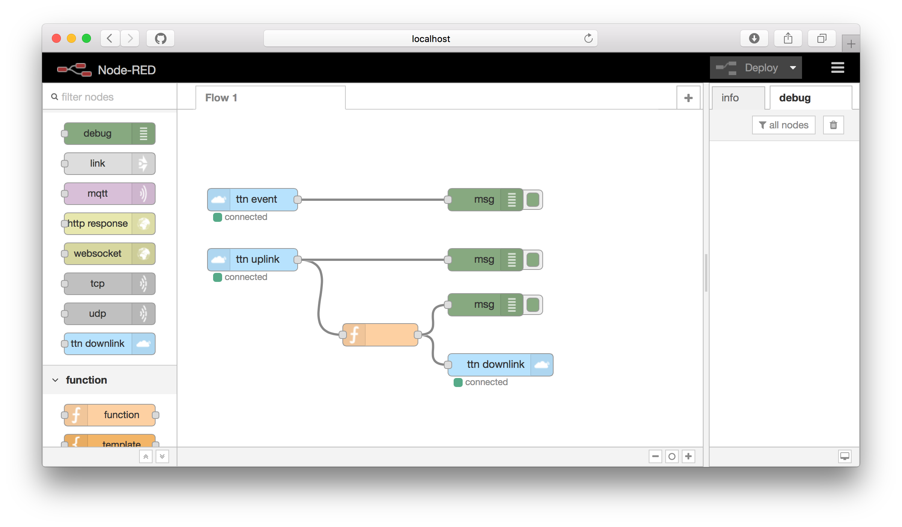

## Quickstart

This quickstart will walk you trough the usage of the TTN node-red nodes for
listening to device uplinks and events, as well as sending downlink in response.

### Setting up the environment

1.  Make sure you have [Node.js](https://nodejs.org/) installed.
2.  Install Node-RED using `npm`:

    ```bash
    npm install node-red -g
    ```

    See Node-RED's [Getting Started / Installation](http://nodered.org/docs/getting-started/installation) for details.
3.  Install the TTN Node-RED nodes:

    ```bash
    cd $HOME/.node-red
    npm install node-red-contrib-ttn
    ```

4.  Run Node-RED:

    ```bash
    node-red
    ```

    Spot a line like this and open the url in the browser:

    ```bash
    29 Aug 11:13:01 - [info] Server now running at http://127.0.0.1:1880/
    ```
    _(If you see a line like '\[warn\] \[node-red-contrib-ttn/ttn-app\]' then visit the Issues chapter.)_

    


### Configuring your application

All The Things Network nodes can share the same application configuration.

1. Create an uplink node by dragging it to the flow and double click it to edit.

  

2. In the *App* field either select an existing app or select *Add new ttn
   app...* and click the `✏️` button.
   _(If you do not see the `✏️` button then visit the Issues chapter.)_

  

  Copy-paste the following information from your application in the Things
  Network Console:

  - For *App ID*, copy the *Application ID* from the *Application Overview*
    section.
  - For *Access Key*, select or create an *Access Key* to use and copy paste it
    by clicking the clipboard icon next to it.
  - For *Discovery address*, you can leave the default community discovery
    address (`discovery.thethingsnetwork.org:1900`) or enter the discovery
    address of your private installation.

3. Click *Add* to save the configuration.

You can now reuse this application configuration in all TTN nodes.

### Receive uplink messages

Messages sent by devices on the application can be received via the *ttn uplink*
node.

1. Drag a *ttn-uplink* node to from the input category of the toolbox to the
   flow.
2. Double click the node to configure it.

  - For *App* select the application you want to use (as configured in the
    [Configuring your application](#configuring-your-application) section).
  - For *device ID* you can enter a device ID you want to filter on. If you
    leave this empty, all uplink messages from all devices will be forwarded.
  - For *Field* you can enter a field you want select from the payload fields of
    your uplink messages. If left empty, the entire uplink message will be
    forwarded. This can be useful if you only the value of one field from the uplink
    messages (eg. `temperature`).

  Click save.

3. Drag the output of the node to the input of a **Debug** node.
4. Double click the *debug* node to edit it.
5. Click the gray part of the **Output** value and select **complete msg
   object** en click **Done**:

   

5. Click **Deploy**.
6. In the right sidebar select the **debug** tab.
7. As soon as your device sends an uplink message, you should be seeing a debug
   statement that looks something like this:

   ```json
   {
     "app_id": "office-app",
     "dev_id": "office-hq",
     "hardware_serial": "0004A30B001B61DE",
     "port": 1,
     "counter": 26438,
     "payload_raw": {
       "type": "Buffer",
       "data": [
         1,
         82,
         1,
         146,
         1,
         124
       ]
     },
     "payload_fields": {
       "celcius": 4.02,
       "light": 338,
       "sound": 380,
       "state": {
         "on": true
       }
     },
     "metadata": {
       "time": "2017-10-24T08:09:15.804117658Z",
       "frequency": 868.1,
       "modulation": "LORA",
       "data_rate": "SF7BW125",
       "coding_rate": "4/5",
       "gateways": [
         {
           "gtw_id": "eui-0000024b0806021d",
           "timestamp": 1866715523,
           "time": "2017-10-24T08:09:15.771341Z",
           "channel": 0,
           "rssi": -85,
           "snr": 9,
           "rf_chain": 1,
           "latitude": 52.39532,
           "longitude": 4.87472,
           "altitude": 9
         }
       ]
     },
     "payload": {
       "celcius": 4.02,
       "light": 338,
       "sound": 380,
       "state": {
         "on": true
       }
     },
     "_msgid": "8c764ace.082e48"
   }
   ```

### Receive device events

We can receive [device events](https://www.thethingsnetwork.org/docs/applications/mqtt/api.html#device-events)
via the **ttn event** node.

1.  Drag a **ttn event** node to the flow and double click it to edit it:

    

2.  Select the application you configured in [Configuring your application](#configuring-your-application).
3.  You can filter the events by device id by filling the **Device ID**
    field.
4.  You can filter the events by their type by filling the **Event** field. The
    default `#` accepts all events.
5.  Click **Done**.
6.  Drag a **Debug** node to the flow and double click to edit it.
7.  Select **Complete message object** from the **Output** dropdown and click
    **Done**
8.  Connect the ouput of the **ttn event** node to the input of the **Debug** node.
9.  Click **Deploy**.
10. Select the **Debug** tab from the right panel:

    

11. Pretty soon, you should be seeing events pass by:

    ```json
    {
      "app_eui": "70B3D57EF000001C",
      "dev_eui": "0004A30B001B7AD2",
      "dev_addr": "26012084",
      "metadata": {
        "time": "2016-09-08T14:04:52.755064047Z",
        "frequency": 868.5,
        "modulation": "LORA",
        "data_rate": "SF7BW125",
        "coding_rate": "4/5",
        "gateways": [{
          "eui": "B827EBFFFE87BD22",
          "timestamp": 1528942955,
          "time": "2016-09-08T14:04:52.716713Z",
          "channel": 2,
          "rssi": -57,
          "snr": 7.5,
          "rf_chain": 1
        }]
      },
      "dev_id": "my-uno",
      "payload": "my-uno",
      "_msgid": "10d6a2ba.ef295d"
    }
    ```

### Send downlink messages

Use the **ttn downlink** node to send messages to devices.

1. Drag a **ttn downlink** node from the output category of the toolbox to the flow
   and double click to edit it.

2. Select the application you configured in [Configuring your application](#configuring-your-application).
3. Click **Done**.
4. Drag a **Function** node to the flow and double click to edit it.
   Paste the following code and click **Done**:

   ```
   return {
     dev_id: msg.dev_id,
     port: msg.port,
     payload: {
       led: !msg.payload.led,
     },
   }
   ```
5. Drag the output of the **Function** node to the input of the **ttn downlink**
   node.
6. Drag the output of the **ttn uplink** node to the input of the **Function**
   node.
7. Your flow should look like this:

   

The next time your device sends an uplink message, a downlink message will be send in response to
toggle the LED. You can use the last **debug node** we added to verify the message
we use as input for the **ttn downlink** node is correct.

👏 You now know how to receive events and messages in Node-RED as well as how to
trigger actions on that, for example by sending a message in response. Now go
build something awesome and share it on [labs](https://www.thethingsnetwork.org/labs/)!

### Issues

Here is a list of common issues users have reported with possible solutions.

#### Cannot configure Application in a TTN node

In some installations it is not possible to add an application or edit the App field. If this is the case then check the startup messages of Node-RED for any warnings or errors about the ttn-app. 

Other symptoms are a warning icon and the text `[object Object]` in the manage palette dialog of Node-RED below node-red-contrib-ttn.

#### Startup message: libstdc++.so.6: version \`GLIBCXX_3.x.xx' not found

Error seen on Raspbian Jessie:
```
[warn] [node-red-contrib-ttn/ttn-app] Error: /usr/lib/arm-linux-gnueabihf/libstdc++.so.6: version `GLIBCXX_3.4.21' not found (required by /home/pi/.node-red/node_modules/grpc/src/node/extension_binary/node-v48-linux-arm-glibc/grpc_node.node)
```
Npm has downloaded incompatible binaries for your system. The solution is to rebuild the affected dependencies from source using npm. For grpc you can use the following commands:
```
cd ~/.node-red
npm rebuild --build-from-source=grpc
```
If this fails then try `npm rebuild` without any package. And if that fails then there is likely an issue with the used Node or Node-RED version.
